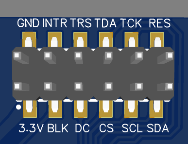

<!--
 * @Author: BlueBoxChamil 283040422@qq.com
 * @Date: 2022-08-30 15:57:13
 * @LastEditors: BlueBoxChamil 283040422@qq.com
 * @LastEditTime: 2022-08-30 17:44:36
 * @FilePath: \20220826\README.md
 * @Description: 
 * 
 * Copyright (c) 2022 by BlueBoxChamil 283040422@qq.com, All Rights Reserved. 
-->
# 使用esp32创建lvgl功能

## 创建时间
20220830

## 目的
1. 创建一个3*3的按钮界面，用于执行不同功能。
2. 按钮界面添加实时钟表的功能。
3. 按钮界面添加控制led灯的功能。
4. 按钮界面添加重力圈的功能。
5. 按钮界面添加图片库。
   
## 硬件
1. 开发板：esp32(devkitv1)
2. 电容触摸lcd显示屏
   
   1. lcd显示屏驱动ic： st7789， 像素240*320， spi接口
   2. 触摸屏驱动ic：CST816S, 像素240*320， iic接口(SDA:21  SCL:22 addr: 0X15)
3. mpu6050 (iic接口 SDA:21 SCL:22 addr：0x68)

## 软件
platformIO IDE库：
1. GFX Library for Arduino
2. Adafruit MPU6050
3. lvgl
4. CST816S(非官方)
## 接线
|    esp32    | 触摸显示屏 | mpu6050 |
| :---------: | :--------: | :-----: |
|     GND     |    GND     |
|     3v3     |    3.3V    |
| D14(GPIO14) |    SCK     |
| D13(GPIO13) |    SDA     |
| D33(GPIO33) |    RES     |
| D12(GPIO12) |     DC     |
|    不接     |    BLK     |
| D21(GPIO21) |    TDA     | MPU_SDA |
| D22(GPIO22) |    TCK     | MPU_SCL |
|  D5(GPIO5)  |    TRS     |
|  D4(GPIO4)  |    INTR    |

 

 ## 编写流程
我不想写了，写注释吧。。。。。

## 结果
